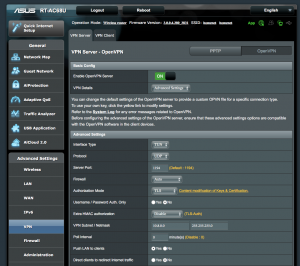
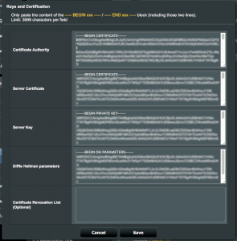
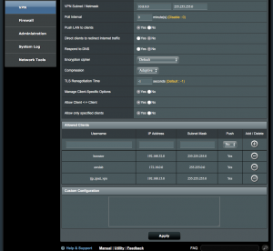
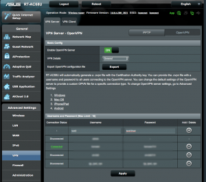
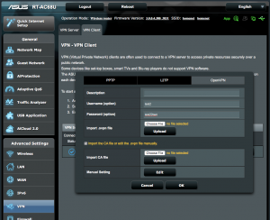
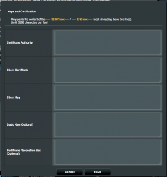

+++
date = '2016-10-01T10:37:22-04:00'
draft = false
title = 'Configure Asus AC-68U Router VPN'
toc = true
+++

The Asus AC-68U (like many routers) supports VPN functionality with the OpenVPN SSL based VPN software.  Out of the box the VPN is very simple to configure.  However, as delivered it uses quite a weak self signed certificate by Asus.  Additionally because of the way the default certs are configured it really only securely supports a single client.

I searched the web and the documentation but didn’t find a good tutorial on configuring the router with your own certificates.   With some trial and error I was able to work out how to configure the system with my own CA and Certs.  This tutorial describes the steps I took to configure the system.  In this tutorial I assume you have your own CA and some basic familiarity with CAs and Certs.

As I have no requirements for externally trusted certificates I have setup my own CA on a Raspberry PI using OpenSSL on my network.  I followed this tutorial to configure the CA. It’s also a very good tutorial for getting up to speed with OpenVPN from scratch.

With the version of OpenVPN on the Asus I’ve noted a few particular settings that are not necessarily the same as other OpenVPN versions.  In particular the server side certificates must be market with the server attribute and the client certs must be marked with the client attribute.  (Note, the Asus CA seems to only generate client certs with the name “client” which means you can have only 1 unique client and cannot use the different client settings in the admin console.)  This was the part that required trial and error because it didn’t become clear that these restrictions were in place until after my original certs were installed.

## Configure your CA

Add sections to your CA configuration file to enable the creation of Server and Client certs. In this case we just need sections and set the nsCertType parameter.  Adding each section separately allows us to create server only and client only certs required by Asus.

```bash
[ server_cert ]
# Use this section to sign a cert that is authorized only for SSL server use.
basicConstraints=CA:FALSE
nsCertType = server
nsComment = "OpenSSL generated certificate - server"
subjectKeyIdentifier = hash
authorityKeyIdentifier=keyid,issuer

[ client_cert ]
# Use this section to sign a cert that is authorized only for SSL client use.
basicConstraints=CA:FALSE
nsCertType = client
nsComment = "OpenSSL generated certificate - client"
subjectKeyIdentifier = hash
authorityKeyIdentifier=keyid,issuer
```

## Create the server certs

Create a certificate request.  Note, this does not need to be created as root.  For this example I’ve created the cert with 1024 bit key.  You should consider using 2048 for greater security.  In the examples that follow I’m using some very generic names.  You’ll want to select names more meaningful to your particular configuration.

```bash
$ openssl req -newkey rsa:1024 -nodes -out test1.csr -keyout test1.key
Generating a 1024 bit RSA private key
...........................................++++++
...++++++
writing new private key to 'test1.key'
-----
You are about to be asked to enter information that will be incorporated
into your certificate request.
What you are about to enter is what is called a Distinguished Name or a DN.
There are quite a few fields but you can leave some blank
For some fields there will be a default value,
If you enter '.', the field will be left blank.
-----
Country Name (2 letter code) [US]:
State or Province Name (full name) [Pennsylvania]:
Locality Name (eg, city) [Blue Bell]:
Organization Name (eg, company) [TJPetz CA]:
Organizational Unit Name (eg, section) []:
Common Name (e.g. server FQDN or YOUR name) []:test1
Email Address []:test@test.com
Please enter the following 'extra' attributes
to be sent with your certificate request
A challenge password []:XXXXXXXXXXX
An optional company name []:

Now sign the cert using the CA.  Note, this needs to be run as root.

$ sudo openssl ca -config /etc/ssl/openssl.cnf -notext -in test1.csr -out test1.crt -extensions server_cert
Using configuration from /etc/ssl/openssl.cnf
Check that the request matches the signature
Signature ok
Certificate Details:
Serial Number: 21 (0x15)
Validity
Not Before: Oct  1 16:42:30 2016 GMT
Not After : Oct  1 16:42:30 2017 GMT
Subject:
countryName               = US
stateOrProvinceName       = Pennsylvania
organizationName          = TJPetz CA
commonName                = test1
emailAddress              = test@test.com
X509v3 extensions:
X509v3 Basic Constraints:
CA:FALSE
Netscape Cert Type:
SSL Server
Netscape Comment:
OpenSSL generated certificate - server
X509v3 Subject Key Identifier:
37:AA:5C:C4:7C:4F:57:7B:EE:7A:E9:20:1F:85:14:CB:E6:7A:2D:1A
X509v3 Authority Key Identifier:
keyid:8E:89:C0:C6:FA:D2:C9:CA:9E:80:9F:D7:F4:7A:B9:C6:64:11:BB:50
Certificate is to be certified until Oct  1 16:42:30 2017 GMT (365 days)
Sign the certificate? [y/n]:y
1 out of 1 certificate requests certified, commit? [y/n]y
Write out database with 1 new entries
Data Base Updated
```

The server cert is now available in test1.crt.  View it’s attributes to confirm it was correctly created.

```bash
$ openssl x509 -in test1.crt -text -noout
Certificate:
Data:
Version: 3 (0x2)
Serial Number: 21 (0x15)
Signature Algorithm: sha256WithRSAEncryption
Issuer: C=US, ST=Pennsylvania, L=Blue Bell, O=TJPetz CA, CN=bbsrv01.home.tjpetz.com/emailAddress=admin@tjpetz.com
Validity
Not Before: Oct 1 16:42:30 2016 GMT
Not After : Oct 1 16:42:30 2017 GMT
Subject: C=US, ST=Pennsylvania, O=TJPetz CA, CN=test1/emailAddress=test@test.com
Subject Public Key Info:
Public Key Algorithm: rsaEncryption
Public-Key: (1024 bit)
Modulus:
00:e3:b6:a2:11:b4:d6:ea:b3:4f:c0:a4:2b:3e:bc:
e9:ab:e3:c0:63:b9:e1:ca:ed:d5:44:51:00:e6:06:
e5:5b:ca:38:26:b1:ab:b8:ab:11:dc:ac:f0:15:a3:
7e:0f:57:eb:8d:d5:d1:6f:9d:c5:d6:ab:02:ac:a5:
81:00:e3:0a:72:90:50:d1:c4:86:e1:fc:e4:d5:29:
c7:cc:04:67:98:a3:8d:73:02:1a:67:6b:f5:83:e4:
36:43:44:0c:98:5d:83:6d:52:6e:2c:f2:02:02:e7:
5a:ae:55:f9:b0:66:62:e2:db:71:7d:d7:ee:52:ea:
c5:d9:ff:71:20:04:3d:0b:23
Exponent: 65537 (0x10001)
X509v3 extensions:
X509v3 Basic Constraints:
CA:FALSE
Netscape Cert Type:
SSL Server
Netscape Comment:
OpenSSL generated certificate - server
X509v3 Subject Key Identifier:
37:AA:5C:C4:7C:4F:57:7B:EE:7A:E9:20:1F:85:14:CB:E6:7A:2D:1A
X509v3 Authority Key Identifier:
keyid:8E:89:C0:C6:FA:D2:C9:CA:9E:80:9F:D7:F4:7A:B9:C6:64:11:BB:50

Signature Algorithm: sha256WithRSAEncryption
b0:cb:62:5c:22:42:50:7c:33:b3:21:9c:12:1f:af:4b:dd:00:
99:a9:cc:1c:57:2d:25:04:a0:25:ed:71:21:68:c4:ec:ee:91:
64:94:a6:f1:2f:c0:da:cc:97:a6:92:ac:f0:3e:b9:78:92:c3:
b0:29:7c:93:47:10:fc:63:f9:c1:5a:e7:8f:02:46:c5:ee:e3:
da:8e:6f:e9:7f:1c:3e:15:60:32:59:18:6f:c4:1c:80:dc:b9:
61:6b:0e:4c:cd:04:ee:eb:e3:8d:a4:8f:bb:b3:6a:fa:06:4b:
8c:ae:7e:a1:e2:72:bf:05:34:55:1b:4a:a5:51:83:e3:a3:21:
da:45:f2:54:f1:06:3f:9b:1c:ea:2d:25:50:ce:e0:47:59:aa:
6e:b9:48:b4:aa:fd:48:2c:9e:98:b7:08:4c:f1:45:d1:61:7e:
c8:29:f2:46:5e:52:96:83:c2:fa:87:46:b5:d9:7e:27:25:e8:
f7:30:d0:7b:12:ef:c7:18:39:40:4c:52:4b:33:e9:f9:8a:b9:
24:a1:90:cc:6a:2d:85:18:ee:fb:11:8e:55:d1:d1:82:0c:c1:
91:b5:8b:c7:ab:94:9c:f1:dd:e7:12:54:f7:59:2c:fd:f7:d0:
d1:84:33:5d:45:23:d2:b8:08:d8:33:b4:d7:bf:c8:1d:28:ed:
80:f0:13:2f:36:66:ce:98:81:23:ac:21:2c:d3:92:12:41:74:
f6:1b:07:7a:77:56:19:3e:76:8c:e3:16:8f:c9:8a:91:93:46:
5d:84:5a:9b:99:c4:20:0e:aa:70:2d:e6:a5:b1:cb:6e:8c:6b:
16:c0:d2:21:f2:f2:8a:d5:28:a9:2a:d9:b6:ba:45:a5:e8:1a:
30:44:4e:53:db:ff:fe:d7:fd:31:a0:0e:db:48:b4:eb:24:94:
04:bd:63:51:4b:06:95:08:64:af:1a:23:af:2c:65:fb:d7:b2:
8d:7b:ad:12:3a:61:c0:63:19:de:81:2d:24:e3:44:16:06:99:
f6:1e:53:a5:ec:6c:6e:c2:bf:54:99:8d:23:18:9d:85:39:97:
37:e3:9e:ab:b2:5b:37:b0:78:4e:0a:87:c1:ca:ed:9c:d1:09:
e0:88:34:1a:3b:ac:fe:e9:e0:0f:66:8a:5f:d5:59:a7:ef:b7:
ec:bb:da:64:a9:6c:60:55:e1:0a:ef:20:2a:e3:a4:78:c9:83:
b5:33:18:17:c7:d3:95:30:94:01:22:fc:ab:11:4b:9e:d0:43:
ca:4a:cd:7f:0a:49:44:aa:0d:33:f8:97:1c:d1:63:09:fc:6a:
ae:5a:8f:d0:f9:91:14:1d:75:80:f7:98:7a:33:43:8e:d9:da:
c8:99:6b:0a:b3:7a:35:21
```

Now we have a server certificate we can use with the Asus router.

## Create the Diffie Hellman Parameters

Next we need to create the Diffie Hellman Parameters.  This is used to generate the share secret that will be used to encrypt each VPN session.

```bash
$ openssl dhparam -out dhparams.pem 1024
Generating DH parameters, 1024 bit long safe prime, generator 2
This is going to take a long time
...................................+............+..........................................................+...........................................................+.+.................+..........+.....................+..........+..........................................................................................................................................................................+............+....................+....+.............................................................................+................................................................+...................................+...........................+................................................................+...................................+.......+....+...................................................+..........+..++*++*++*
```

## Configure the CA and certs in Asus router.

From the VPN menu select Advanced and then follow the link “Content modification of Keys & Certificates” in the Authorization Mode section.



- Paste the public key certificate of your CA into the “Certificate Authority” field.
- Paste the contents of test1.crt into the “Server Certificate” field.
- Paste the contents of test1.key into the “Server Key” field.
- Past the contents of dhparams.pem into the “Diffie Hellman parameters” field.

If you ever need to revoke a client cert you can paste the revocation in the the final field.



## Configure the client options

To enable LAN to LAN connectivity you need to enable client specific settings.  Select the following options:

- Manage Client-Specific Options = Yes
- Allow Client <-> Client = Yes
- Allow only specific clients = Yes



Now configure the client.  In this case I have 3 clients configured.  The first is another Asus router at another location, the second is a private network on AWS, and the third is my iPad.  In each case the IP Address entered is the address of the client network.  Note, this will almost always be a private IPv4 subnet.  I also set the Push option to Yes to enable the routing tables to be correctly updates when a client connects to the VPN servers.

## Add VPN Clients

To add VPN clients we start by creating the client certificates.  It’s very important to set the CN of the client cert to the user/client name we enter into the Asus router.  In this example the client is names test2.  You will probably want to use a more meaningful name for your configuration.

Start by creating the certificate request:

```bash
$ openssl req -newkey rsa:1024 -nodes -out test2.csr -keyout test2.key
Generating a 1024 bit RSA private key
................................................++++++
.............................................................++++++
writing new private key to 'test2.key'
-----
You are about to be asked to enter information that will be incorporated
into your certificate request.
What you are about to enter is what is called a Distinguished Name or a DN.
There are quite a few fields but you can leave some blank
For some fields there will be a default value,
If you enter '.', the field will be left blank.
-----
Country Name (2 letter code) [US]:
State or Province Name (full name) [Pennsylvania]:
Locality Name (eg, city) [Blue Bell]:
Organization Name (eg, company) [TJPetz CA]:
Organizational Unit Name (eg, section) []:
Common Name (e.g. server FQDN or YOUR name) []:test2
Email Address []:test2@test.com

Please enter the following ‘extra’ attributes
to be sent with your certificate request
A challenge password []:XXXXXXXXX
An optional company name []:
```

Then sign the request:

```bash
$ sudo openssl ca -config /etc/ssl/openssl.cnf -notext -in test2.csr -out test2.crt -extensions client_certUsing configuration from /etc/ssl/openssl.cnf
Check that the request matches the signature
Signature ok
Certificate Details:
Serial Number: 22 (0x16)
Validity
Not Before: Oct 1 19:06:02 2016 GMT
Not After : Oct 1 19:06:02 2017 GMT
Subject:
countryName = US
stateOrProvinceName = Pennsylvania
organizationName = TJPetz CA
commonName = test2
emailAddress = test2@test.com
X509v3 extensions:
X509v3 Basic Constraints:
CA:FALSE
Netscape Cert Type:
SSL Client
Netscape Comment:
OpenSSL generated certificate - client
X509v3 Subject Key Identifier:
C0:D6:42:7E:8A:4E:E4:E5:7E:66:0D:72:1D:0F:B3:BA:C9:A3:C2:E5
X509v3 Authority Key Identifier:
keyid:8E:89:C0:C6:FA:D2:C9:CA:9E:80:9F:D7:F4:7A:B9:C6:64:11:BB:50

Certificate is to be certified until Oct 1 19:06:02 2017 GMT (365 days)
Sign the certificate? [y/n]:y

1 out of 1 certificate requests certified, commit? [y/n]y
Write out database with 1 new entries
Data Base Updated
```

## Create the client account

Switch back to General mode on the server and then add an account for the client.  The Username must match the CN in the certificate.  Pick a suitably complex password.  However the real security of the connection is ensured by the certificate rather than the password.



## Install the certificates into the client VPN

Access the VPN client router and select OpenVPN on the VPN Client tab.  Enter the username and password created in the previous step.  Select the option to “Import the CA file or edit the .ovpn file manually.”.



Press “Edit” in Manual Settings where you can paste in the certificates.



- Paste your CA’s public cert into “Certificate Authority” field.
- Paste the contents of test2.crt into the “Client Certificate” field.
- Past the contents of test2.key into the “Client Key” field.
- You may leave the other fields blank.

If all went well the client VPN should now establish a connection with the VPN server.  Review the system error log to resolve any errors if the connection is not successful.
