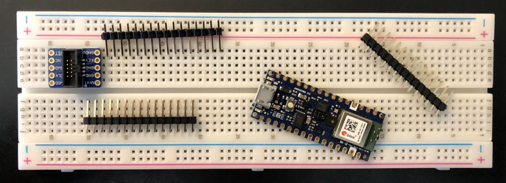
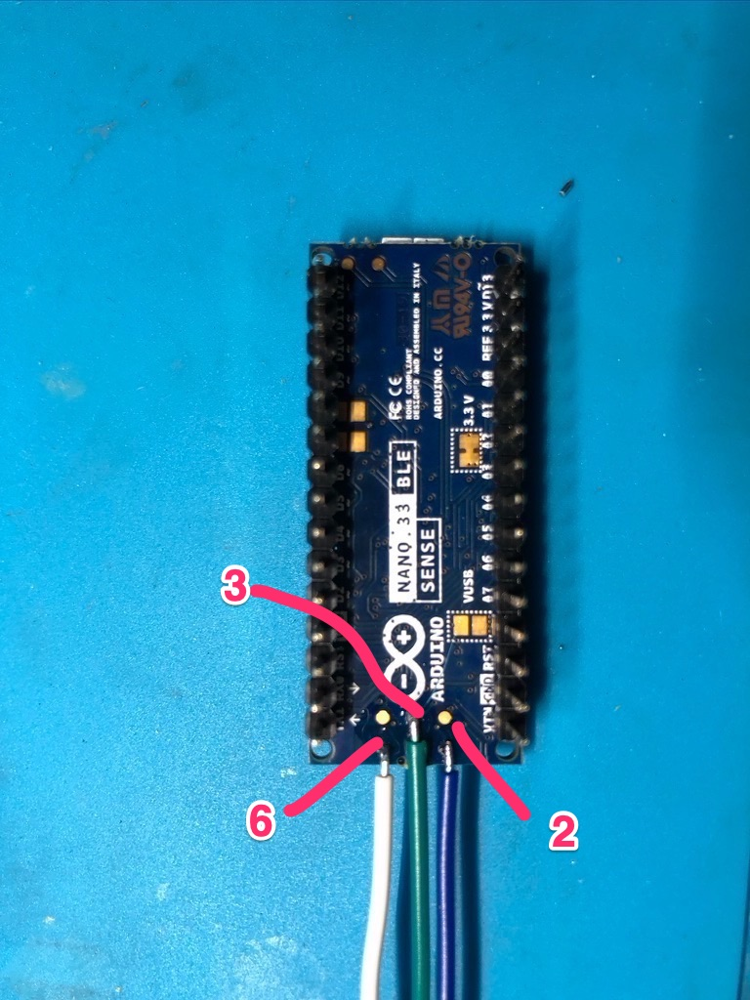
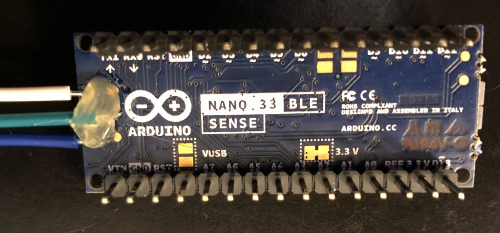
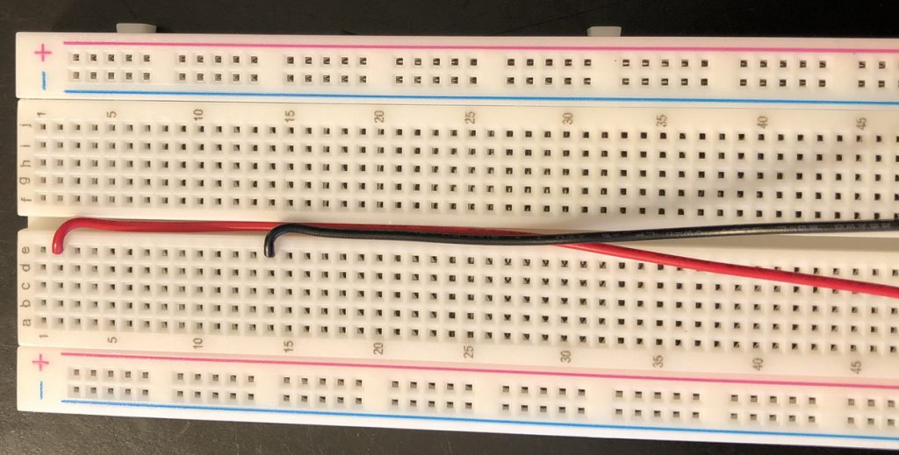
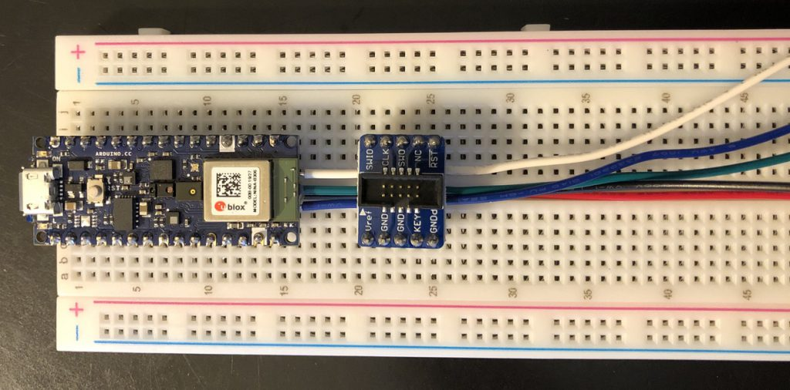
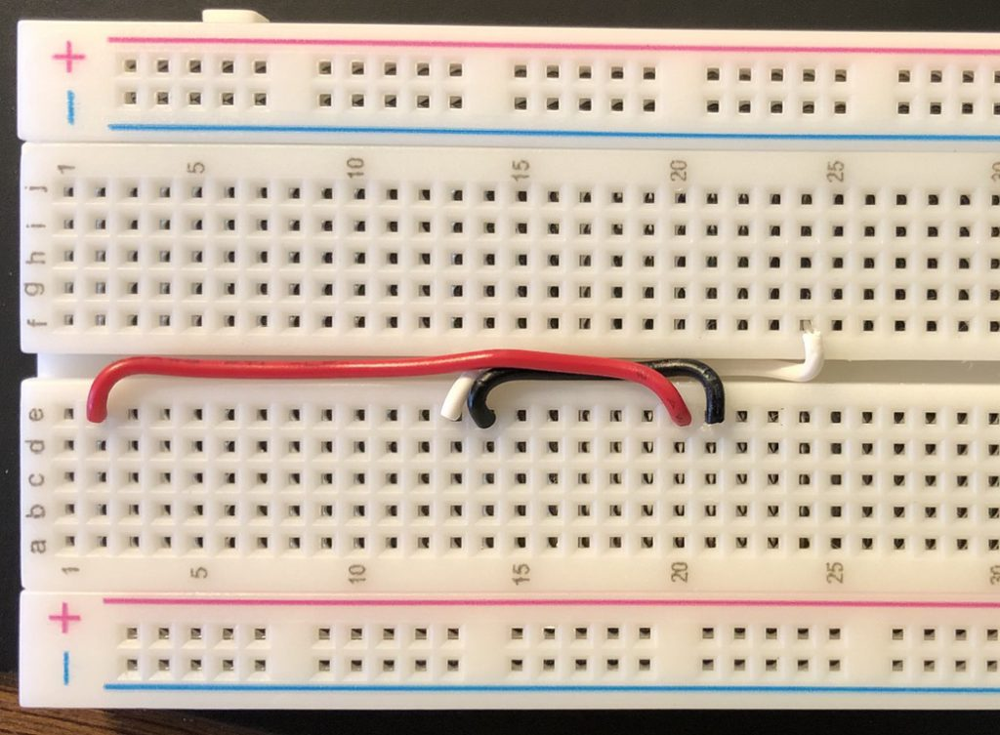
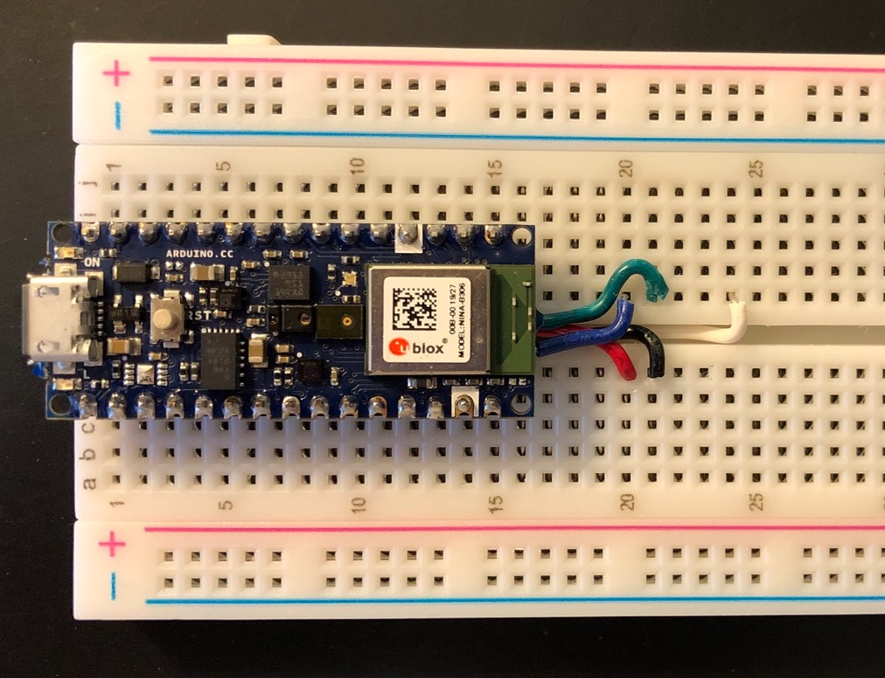
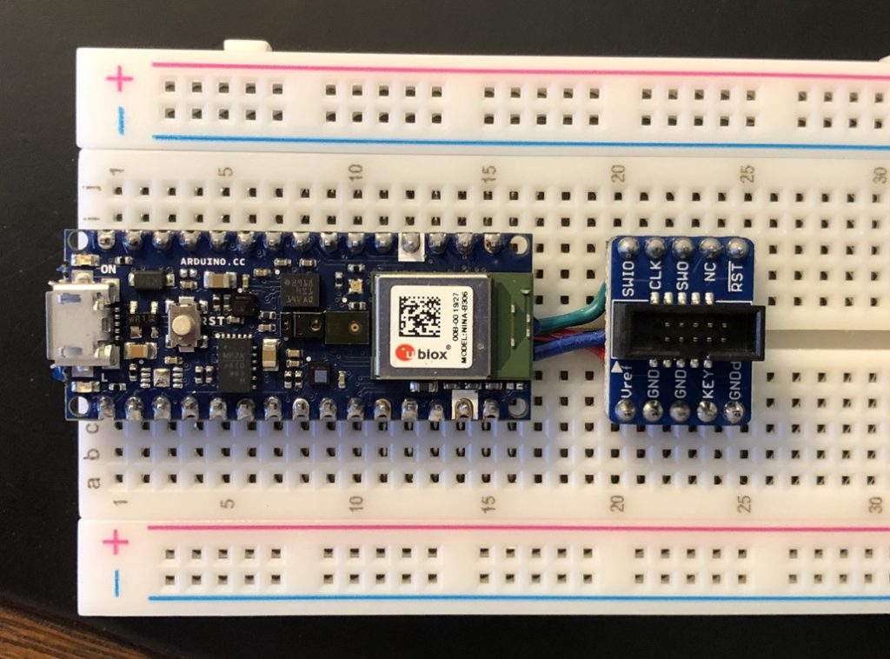
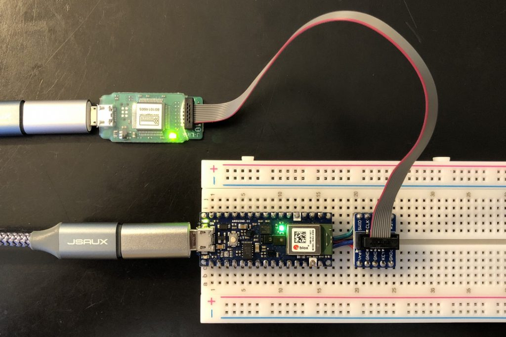

+++
date = '2020-05-09T17:50:01-04:00'
draft = false
title = 'SWD Breakout and Breadboard for Nano 33 BLE Sense'
lead = 'Add a SWD debugger to your Nano 33 BLE, BLE Sense, or IOT'
categories = ["microcontrollers"]
tags = ["nano33"]
+++

The Arduino Nano 33 BLE (Sense) and the Nano 33 IoT expose SWD pads on the bottom of the board.  These pads expose the SWD interface that enable debugging when used with an SWD compatible debugger such as the Segger [J-Link Mini EDU](https://www.segger.com/products/debug-probes/j-link/models/j-link-edu-mini/).

The pads on the bottom of the Nanos are very small (and as we’ll see later quite fragile).  Normally you would use some form of test fixture and pogo pins to connect to the pads.  I don’t have that.  Some approaches show soldering dupont wires to the pads and then connecting to the J-Link via and adapter.

I’ve used a solderless breadboard with my Nano 33 BLE Sense and an [Adafruit SWD Breakout Board](https://www.adafruit.com/product/2743) to build a debugging and breadboard setup.

The SWD debugging interface needs GND, the 3.3v Reference, SWCLK, SWDIO, and RESETN.  All these signals are available on the bottom of the Nano board.  To minimize the number of wires to solder I decided to pull SWCLK, SWDIO, and RESETN (turned out to be a bad idea) from the pads.

Step 1 is to solder the wires to the Nano.

Pin 2 (Blue) = SWDIO
Pin 3 (Green) = SWCLK
Pin 6 (White) = RESETN

Applying some hot glue (should) help keep the wires in place.

Now we start assembling the solderless breadboard.  Here we’ll wire the 3.3 volt reference to Pin 2, pickup ground from Pin 14.  We’ll run the wires down the central channel to maintain clearance under the Nano.

Now we start to layout the board with our wires.

We’ll run the wires so they are neat and go under each board.  

While assembling, the White Wire, Pin 6 (RESETN) ripped off the board 😞   A most unhappy moment.  I was being very careful while stripping the wire but it must have slipped.  Reviewing the board and the photos the hot glue was probably not making sufficient contact with the board over the white wire.

While reviewing videos on repairing PCBs I decided to go double check which wire was ripped off.  At that point I realized that it was the RESETN and that signal is also available on Pin 13 of the Nano header.  Rather than attempt to repair the board (for which i don’t really have the right tools) I decided to simply take the RESETN signal from the header.

The Nano is then placed on the board the SWCLK and SWDIO are carefully routed to their pins on the breakout board.

The breakout board may now be placed on the breadboard.

Finally we can now connect the Segger J-Link Mini EDU.

